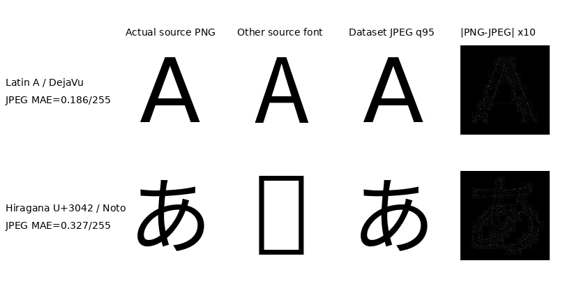

# HR-Font 合作者技术说明

> 用途：统一解释官方 FontDiffuser、现有跨语言微调数据和实验来源。  
> 项目状态与下一步只看 [`PROJECT.md`](PROJECT.md)；本文件仅记录相对稳定的技术事实。

## 1. 先看结论

- 官方论文任务：中文 Content + 中文 Style → 中文 Target。
- 我们的适配任务：中文 Style → 拉丁/假名 Target。
- `ft_cnstyle@25k`：42个训练字体，可验证。
- 当前没有可验证的 `ft_p253@18k`；实际最高有效权重是 `ft_p253_cnstyle@12k`。
- 两套FT均从官方 Model Zoo 发布的 FontDiffuser checkpoint 初始化。
- 官方没有标明该checkpoint是Phase 1还是经过Phase 2的最终生成器，因此不得再称其为“确定的官方Phase-1 checkpoint”。
- 两套FT都关闭SCR，使用Phase-1形式的生成损失，并更新UNet、Content Encoder和Style Encoder全部参数。

## 2. 官方 FontDiffuser

依据：

- 论文：[FontDiffuser, arXiv:2312.12142](https://arxiv.org/abs/2312.12142)
- 官方仓库：`code/FontDiffuser`
- 官方训练入口：
  - `code/FontDiffuser/scripts/train_phase_1.sh`
  - `code/FontDiffuser/scripts/train_phase_2.sh`

### 官方数据

- 共424个中文字体。
- 训练：随机选择400个seen fonts、800个seen Chinese characters。
- Content：约800张源字体字符图。
- Target：400×800，约320000张。
- 每个训练样本随机选择一张同字体、不同字符图作为1-shot Style；官方没有独立 `StyleImage` 目录。
- SFUC：100个seen fonts × 272个unseen characters。
- UFUC：24个unseen fonts × 300个unseen characters。
- UFSC：24个unseen fonts × 800个seen characters。

### SCR预训练

- 数据：400字体×800字符，与生成器训练集相同。
- 图像：96×96。
- 正样本：同图随机裁剪、缩放增强。
- 负样本：48个相同字符、不同字体样本。
- AdamW，LR=1e-4，linear scheduler，warmup=1000。
- 只训练SCR；不训练FontDiffuser生成器。
- 论文未明确给出总步数；`scr_210000.pth` 的文件名不能替代论文配置。

### 官方Phase 1

- batch=16，440000 steps。
- LR=1e-4，linear scheduler，warmup=10000。
- CFG condition dropout=0.1。
- FP32。
- 训练UNet、Content Encoder、Style Encoder。
- 不使用SCR。

损失：

```text
L_phase1 = L_MSE + 0.01 * L_content_perceptual + 0.5 * L_offset
```

### 官方Phase 2

- 从Phase-1生成器继续训练。
- batch=16，30000 steps。
- LR=1e-5，constant scheduler。
- 每个样本增加16个相同字符、不同字体负样本。
- 继续训练UNet、Content Encoder、Style Encoder。
- 预训练SCR冻结，仅提供Style Contrastive监督。

损失：

```text
L_phase2 = L_MSE + 0.01 * L_content_perceptual
           + 0.5 * L_offset + 0.01 * L_style_contrastive
```

## 3. 我们的42字体微调

标识：`FT-CNSTYLE-25K`

- 数据：`data/fontdiffuser`
- 42个训练字体；Demo-8不进入训练。
- nominal Content：P1 122字符 + P2 42字符，共164；空格无有效Target，实际每字体163个Target。
- Target总数：6846。
- 中文Style总数：11886，每字体8–338张。
- 每个样本随机选择1张同字体中文Style；训练不是固定“永”。
- 评测固定使用1-shot“永”。
- batch=4，LR=1e-5，linear scheduler，warmup=1000。
- 原训练计划30k，当前使用25k checkpoint。
- CFG dropout=0.1，FP32。
- SCR关闭；三个生成网络全部更新。

## 4. 我们的253字体微调

当前有效标识应写为：`FT-P253-CNSTYLE-12K`

- 数据：`data/fontdiffuser_p253`
- 253个训练字体。
- 每字体163个有效Target，总数41237。
- 中文Style总数2024，即每字体固定8张：

```text
永 和 书 风 骨 韵 天 地
```

- 每个样本从8张中随机选择1张Style。
- batch=24，LR=2e-5，linear scheduler，warmup=1000。
- 实际完成12000 steps。
- CFG dropout=0.1，FP32。
- SCR关闭；三个生成网络全部更新。

`continue_after.json` 曾计划从12k再训练6k，但没有对应run目录、日志或checkpoint。因此不得将计划写成已完成18k。即使该命令成功，它也只加载模型权重，不恢复AdamW和scheduler状态，属于warm restart，而非严格连续resume。

## 5. 两套FT不是严格字体规模消融

42→253时同时改变了：

- 字体数：42→253。
- Style池：每字体8–338张→固定8张。
- batch：4→24。
- LR：1e-5→2e-5。
- 使用checkpoint：25k→12k。

因此两套结果不能只解释为“增加字体数量带来的提升”。

## 6. 渲染与输入处理

初始渲染：

1. Pillow从TTF渲染128×128灰度图，白底黑字。
2. 二分搜索最大字号，使字形保留约8像素边距。
3. 按字体bbox居中。
4. P1拉丁Content使用DejaVu Sans。
5. P2假名/注音Content使用Noto Sans CJK；DejaVu缺少完整假名覆盖。
6. Target和中文Style均使用对应目标字体渲染。
7. PNG转为JPEG quality=95；训练时双线性缩放到96×96并归一化到[-1,1]。

示例：



JPEG是有损格式，但测得平均像素误差很小：

- 拉丁A：0.186/255。
- 平假名“あ”：0.327/255。

官方README目录示意写PNG，但仓库实际 `data_examples` 是128×128灰度JPEG；官方Dataset最终也会 `.convert("RGB")`。因此JPEG并非完全偏离官方实现。不过新数据版本建议统一保留无损PNG，现有实验不可中途改格式。

## 7. 相对官方代码的确定改动

用于跨语言FT且可以确认的改动：

1. `dataset/font_dataset.py`
   - 官方：从同字体Target池随机取Style。
   - 我们：若存在 `StyleImage/<font>/`，只从独立中文池随机取Style。
2. `train.py`
   - 官方：仅Phase 2加载 `phase_1_ckpt_dir`。
   - 我们：在SCR关闭时也允许加载三个官方发布权重进行微调。
3. `scripts/retrain_v2_finetune_fontdiffuser.py`
   - 增加data root、run name、初始化权重、batch、LR和重建数据入口。
4. 自定义跨语言数据制作
   - 将中文Style与拉丁/假名Target组织为FontDiffuser布局。

MCA、RSI和扩散目标没有为这两次FT做计划性结构替换。当前仓库后来加入的Stroke-SCR及256分辨率改动，不得追溯到这两个历史FT。

## 8. Checkpoint命名规范

官方发布目录 `code/FontDiffuser/ckpt` 只有：

- `unet.pth`
- `content_encoder.pth`
- `style_encoder.pth`
- 独立的 `scr_210000.pth`

前三个文件没有阶段元数据。Phase 1和Phase 2都会生成同名文件，最终推理也不需要SCR。因此项目统一使用：

```text
官方发布FontDiffuser checkpoint（stage unspecified）
```

禁止写成“确定的官方Phase-1 checkpoint”或“确定的最终Phase-2 checkpoint”。

## 9. 可追溯入口

- 当前项目状态：`PROJECT.md`
- 42字体数据指纹：`provenance/datasets/fontdiffuser42-cnstyle-v1.json`
- 42字体25k来源：`provenance/runs/FT-CNSTYLE-25K.json`
- Stage A来源：`provenance/runs/A-MVP-CONTROL.json`、`A-MVP-DELTA.json`
- 根项目Git：管理自研脚本、台账和来源记录。
- FontDiffuser本地补丁Git：分支 `hrfont/local-patches-20260903`，恢复基线 `99e42b5`。

历史FT发生在根项目Git建立之前。数据、命令、配置和权重可以校验，但当时未提交的源码不能逐字节恢复，来源等级标记为 `retro_partial`。
