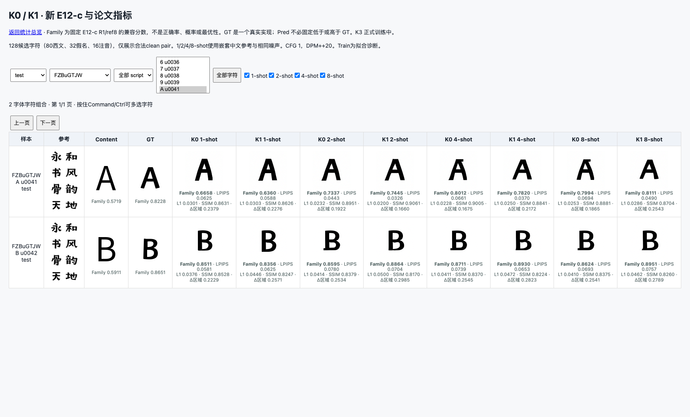
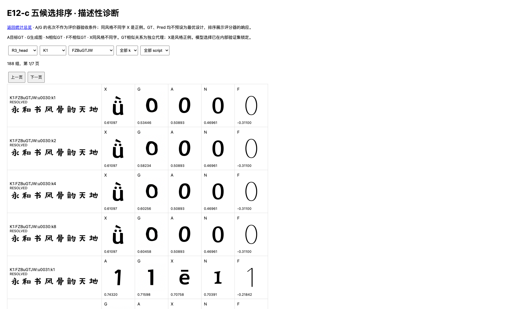

# K族与E12-c完整结果索引 · 2026-09-17

这是截至2026-09-17T18:10:59.552035+08:00的结果快照。此前计划/启动报告为历史记录，当前结论以本页链接的实测结果为准。

## 当前实验状态

- K0：原始Test与默认Train/Val/Test×1/2/4/8-shot均完成。
- K1：同K0父模型独立启动，10k完成，原始Test每模型2816图、默认推理每模型11648图均已完成；完整评估共28928条K0/K1记录。
- K2：无已完成实验。
- K3：4225/10000，0 AMP跳步、8rank参数差0；2k和4k VAL192已完成，最终Train/Val/Test推理与论文指标尚未完成。最终后处理和同阈值分层统计均已排队。

## 已观察到的结果

原始47字符主测试中，K1字体宏平均LPIPS相对K0改善4.56%，L1改善2.98%，D_change改善3.07%；Family增加0.00316，但95%字体配对区间[-0.00260,0.00938]跨零。分script后西文LPIPS改善5.49%，假名反而轻微变差0.20%；不能宣称全部script风格统一提升。默认扩展Val的Family也下降，结果完整保留。

K3@2k相对K1@2k的D_region约改善0.60%，其他变化较小且多项区间跨零；仅是早期栅格指标，尚不能宣称强化监督有效或风格问题解决。K3@4k相对冻结K0的阶段值另表保留。当前不设置效果停训门槛。

主评价器E12 R1_cosine验证/独立测试AUC为0.97099/0.94832，GT关系Spearman rho=0.86026、Kendall tau-b=0.80915。它是兼容性代理，不是最优设计或人评偏好；人评相关性、字符识别准确率仍缺实测依据。

## 字符覆盖澄清

32是每次global64中的西文样本配额，非字种数量。223个训练字体各含完整89种西文：52大小写字母+10数字+27扩展拉丁。K1前15步即见全89种，10k累计每字种3414–3736次；字体×字符覆盖19824/19847，仍有23个组合未抽到。K3也已见全89种。采样回放与保存的各千步曝光计数一致。

## 报告与数据入口

- [E12-c完整报告](e12c_complete_20260917/REPORT.md)：实现、训练数据、选择规则、独立测试、全部相关性、GT控制、K族应用、结论边界及逐查询原始结果。
- [K族论文指标与分析](k_paper_metrics_20260917/REPORT.md)：全部可用指标、匹配主测试、Train/Val/Test、置信区间、缺失指标说明。
- [shot×script×难度](k_stratified_20260917/REPORT.md)：600个均值分组、2100行配对差及区间、逐图分层、阈值和检查。
- [训练字符覆盖](k_character_coverage_20260917/REPORT.md)：当前89字清单、逐字及逐字体×字抽样次数、未覆盖项和改进建议。
- [K3早期匹配评估](k3_early_matched_20260917/REPORT.md)：K1/K3@2k冻结VAL192，以及K3的2k/4k阶段数据。
- [最新状态快照](k_paper_metrics_20260917/CURRENT_SNAPSHOT.json)。
- [K3训练计划](K3_AUTHORIZED_TRAINING_PLAN_20260917.md)。

## 可视化与复现





Git同步范围包括报告、全部逐样本评分、统计表、清单和哈希证据、示例图与执行脚本。完整图像浏览产物位于执行机：

- K0/K1默认面板：/root/projects/hrfont/reports/k_default_k1248_20260917/index.html。
- E12：/root/data1/hrfont_e12c_r2_20260917/review/index.html。
- K3完成后：/root/data1/hrfont_k3_complete_review_20260917/index.html。
- K3完成后的分层统计：/root/data1/hrfont_k3_stratified_results_20260917/index.html。

全量PNG、模型权重和特征缓存继续遵守仓库.gitignore的重资产约定，不重复压入Git历史。数值分析可用scripts/k_stratified_report.py重建；字符覆盖可在执行机用scripts/audit_k_character_coverage.py回放。压缩JSON可用Python gzip.open读取；E12完整证据归档不含模型权重。

## 训练设计不变与下一步

K1/K3主训练均为中文参考→西文/假名/注音，不含中到中或西到中生成目标。新数据尚未接入；后续版本需记录新增字符、风格/字体去重和任务配比。K3继续既定10k，之后完成matched推理、指标和分层。风格监督是否奏效最终还需完整输出参考置换、TC/Delta消融与视觉证据，不能仅凭梯度或损失下降判断。

## 从Git中的原始评分重建统计

安装numpy、pandas、scipy后，在仓库根目录运行：

```bash
python scripts/rebuild_k_e12_report.py --output work/k_e12_recomputed
```

该命令只读取本次归档的评分与固定难度标签，无需GPU、原始字图或实验机访问；输出目录必须尚不存在。它重建数值统计和交互统计页，不重新生成图像。
