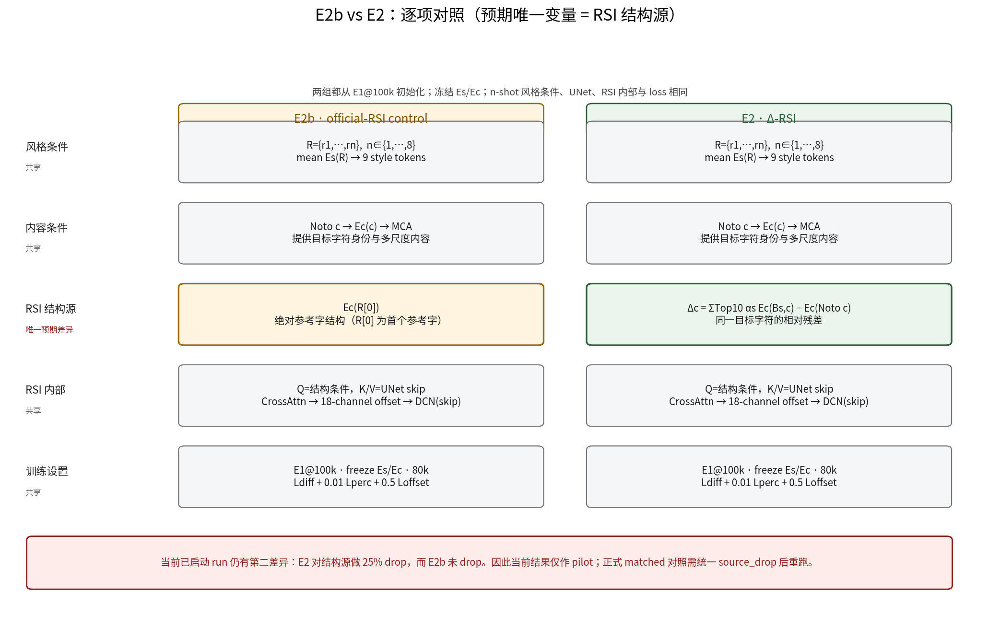
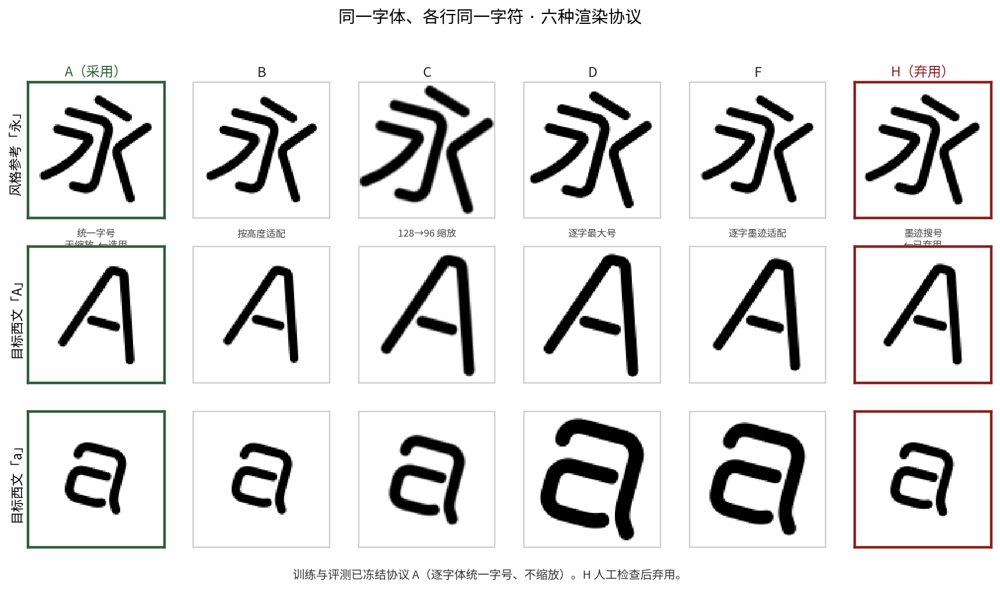
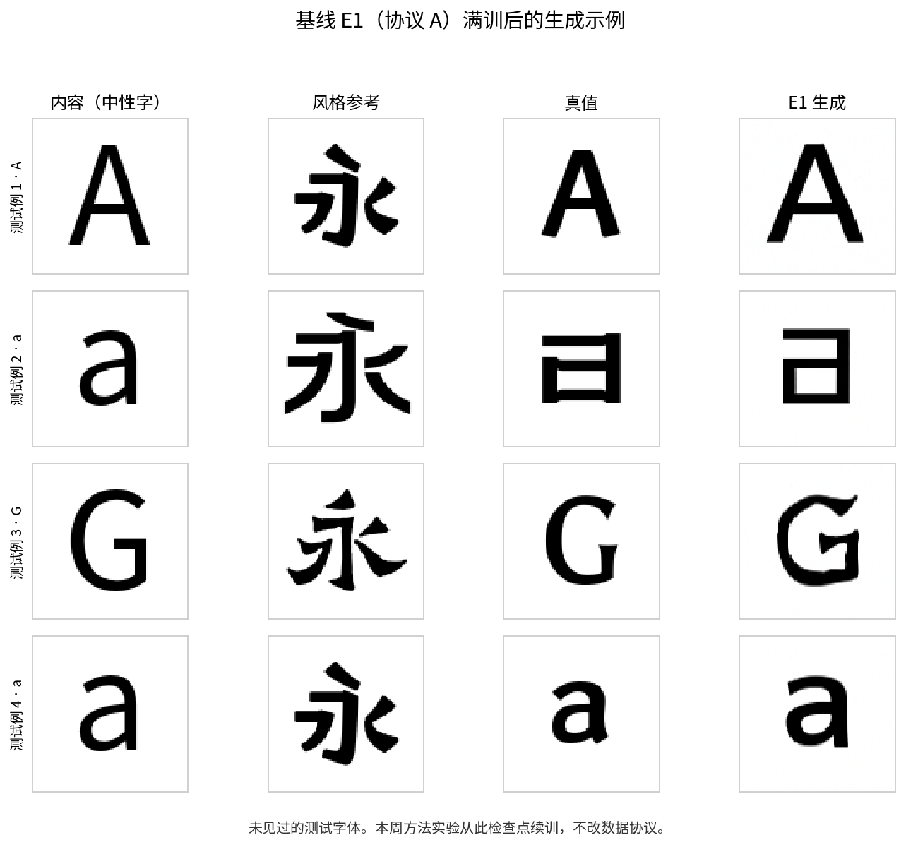

# HR-Font 周报 · 2026-09-05

对象：导师（只读本页）。基模为 **FontDiffuser (FD)**。任务：以目标字体的少量汉字为风格，生成同一字体中的拉丁字母。

**本周结论：** FD 在自建中文→西文数据上的微调基线（E1）已训完；方法已接到 FD 上；主对照 E2 / E2b 正在跑；E1c 因显存占用未开。

## 1. 方法：将 RSI 的参考字结构改为目标字残差

FD 的输入本来就是两个不同字符：一张中性字体的**内容图**指定要生成哪个字；另一张同目标字体的**参考图**提供风格。官方训练代码会从同一字体中随机选择参考字，并排除当前目标字。

FD 对参考图做两次编码：\(E_s\) 提取风格；\(E_c\) 提取参考字的结构图，送入 RSI。RSI 以参考结构为 Query、UNet 的内容 skip feature 为 Key/Value，通过 cross-attention 预测可变形卷积的位移，再重采样 skip feature。因此，“参考字与目标字不同”不是 FD 的实现错误，而是它原本的设计。

RSI 没有位移真值；训练中的 offset loss 只限制位移不要过大，正确形变主要由最终生成图的扩散损失和感知损失间接学习。

我们关注的是这一设计在**跨语系**时可能存在的局限：相较于同语系异字，中文参考与拉丁目标的局部结构共享可能更弱。RSI 虽然能够学习空间错位，但由汉字参考结构预测拉丁字母形变可能较难。**这是本文待验证的假设，不是已经证实的结论。**

我们的改动是：风格仍由中文参考提供，但给 RSI 的结构条件改为**从字体库估计的、同一目标字符的相对变化**。

以生成 `a` 为例：

1. 用目标字体的若干汉字参考，经 \(E_s\) 判断它与训练字体库中哪些字体最相近；
2. 从最相近的 10 套库字体中取出各自的 `a`，在 \(E_c\) 特征空间按相似度加权；
3. 减去中性字体 Noto 的 `a` 特征，得到同字残差

\[
\Delta_a=\sum_{s\in\mathrm{Top10}}\alpha_s E_c(a_s)-E_c(a_{\mathrm{Noto}}).
\]

\(\Delta_a\) 旨在削弱各字体共有的 `a` 身份分量，突出相对中性 `a` 的特征变化；我们预期它能提示笔画粗细、曲率、端点和局部比例应如何调整。字符身份仍由 Noto `a` 提供，中文参考的风格仍由 \(E_s\) 提供。

因此，我们**不修改 FD 的 UNet、RSI 注意力或可变形卷积，只替换 RSI 的输入条件**：  
官方为 \(E_c(\text{参考字})\)，我们在中文→西文任务中改为 \(\Delta_{\text{目标字母}}\)。该替换是否优于官方 RSI，最终由 E2 与 E2b 的配对实验判断。

详细的论文、代码数据流与 loss 审查见 [RSI_CORRECTNESS_REVIEW_20260905.md](./RSI_CORRECTNESS_REVIEW_20260905.md)。

下图将 E2b 与 E2 逐项对齐；灰色行均相同，只有“RSI 结构源”是预期主变量。底部红框单列当前运行中发现的额外差异。

## 2. 数据与 E1 基线

渲染试了六种策略（字号是否统一、是否缩放、是否逐字撑满）。**训练与评测冻结协议 A**：逐字体统一字号、96×96、不缩放。H 经人工检查后弃用。

**E1**：在协议 A、拆分 228/16/16 上微调官方 FD，100k 步，已完成。下图为未见过的测试字体：内容 / 汉字风格 / 真值 / E1 生成。后续实验均从 E1@100k 初始化，冻 \(E_s/E_c\)，只训 UNet 与 RSI 形变头。

## 3. 本周实验（三组，同一起点、同一预算）

| 实验 | 相对 E1 改了什么 | 用来回答 |
|---|---|---|
| **E1c** | 冻结编码器的 1-shot official-RSI 训练臂，结构源为 \(E_c(R[0])\) | 不改 RSI 的 1-shot 基线 |
| **E2b** | 多张汉字参考的 9-token 风格条件；结构源为 \(E_c(R[0])\) | Δ 的 official-RSI 对照 |
| **E2** | 风格与 E2b 相同；结构源改为 Δ | Δ 是否有独立贡献 |

预期主结论来自 **E2 vs E2b**；E1c vs E2b 用于观察多参考风格条件的影响。但代码复查发现，当前 E2 对结构源做 25% drop，而 E2b 未做同样的 drop，因而当前两条长跑只能作为 pilot，不能作为最终 matched 结论。正式比较需统一 `source_drop` 后重跑。

## 4. 进度与需知情事项

- 方法已接入训练，短跑通过。
- 截至 09-05 13:55，**E2b** 为 27800/80000（约 35%）；**E2** 为 9200/80000（约 12%）。二者同日、同提交启动，但因上述 source-drop 差异暂不视为严格 matched。
- **E1c 未启动**：两张 GPU 被已退出进程占满显存，重置驱动会中断 E2/E2b。默认先保主对照，E2b 结束后补 E1c。

下一步先修正并验证统一 source-drop，再确定正式 E2/E2b 重跑安排；当前运行保留作诊断，不覆盖。
